# Machine Learnig Concepts:

## What is Machine Learning ?

```Machine learning is in many ways the intersection of two disciplines - data science and software engineering.```

The goal of machine learning is to use data to create a predictive model that can be incorporated into a software application or service. To achieve this goal requires collaboration between data scientists who explore and prepare the data before using it to train a machine learning model, and software developers who integrate the models into applications where they're used to predict new data values (a process known as inferencing).

<p align="center">
  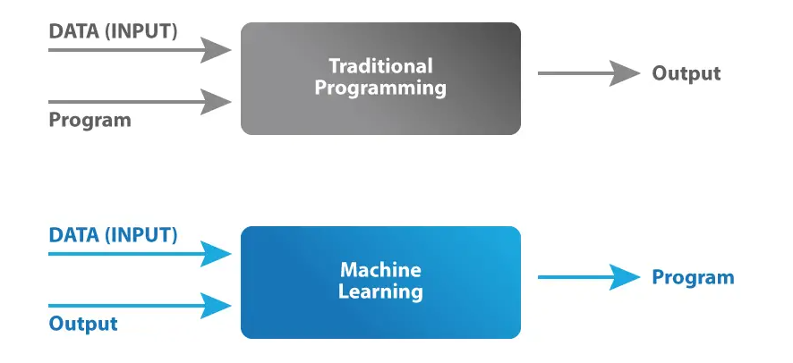
</p>

Machine learning is a subfield of artificial intelligence that focuses on the development of algorithms and statistical models that enable computers to learn and make predictions or decisions without being explicitly programmed. 

<p align="center">
  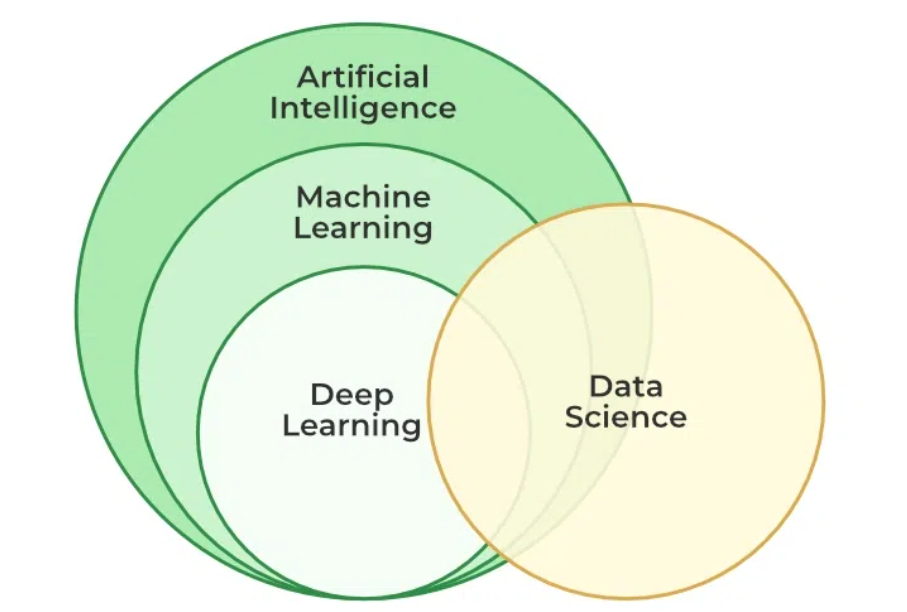
</p>

It involves training algorithms on large datasets to identify patterns and relationships and then using these patterns to make predictions or decisions about new data.

Machine learning is a type of artificial intelligence (AI) that helps computers learn from data and improve their performance without needing constant instructions. It uses algorithms to find patterns, make predictions, and solve problems.

```machine learning teaches computers to "learn" and "improve" on their own using data.```

### **How it works:**

<p align="center">
  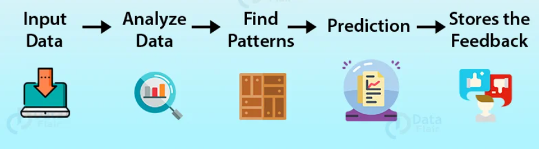
</p>

1. **Data:** You feed the machine lots of examples (called "training data").
2. **Model:** The machine builds a model—a mathematical representation—based on patterns it finds.
3. **Learning:** It adjusts the model to minimize errors (using algorithms).
4. **Prediction:** Once trained, the model can make predictions or decisions on new, unseen data.

<p align="center">
  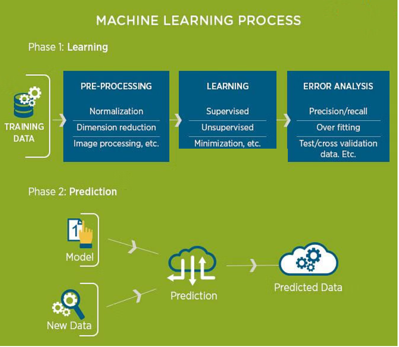
</p>

### Important Terminology:

* **Model:** Also known as “hypothesis”, a machine learning model is the mathematical representation of a real-world process. A machine learning algorithm along with the training data builds a machine learning model.
* **Feature:** A feature is a measurable property or parameter of the data-set.
* **Feature Vector:** It is a set of multiple numeric features. We use it as an input to the machine learning model for training and prediction purposes.
* **Training:** An algorithm takes a set of data known as “training data” as input. The learning algorithm finds patterns in the input data and trains the model for expected results (target). The output of the training process is the machine learning model.
* **Prediction:** Once the machine learning model is ready, it can be fed with input data to provide a predicted output.
Target (Label): The value that the machine learning model has to predict is called the target or label.
* **Overfitting:** When a massive amount of data trains a machine learning model, it tends to learn from the noise and inaccurate data entries. Here the model fails to characterize the data correctly.
* **Underfitting:** It is the scenario when the model fails to decipher the underlying trend in the input data. It destroys the accuracy of the machine learning model. In simple terms, the model or the algorithm does not fit the data well enough.

**7 Steps of Machine Learning:**

<p align="center">
  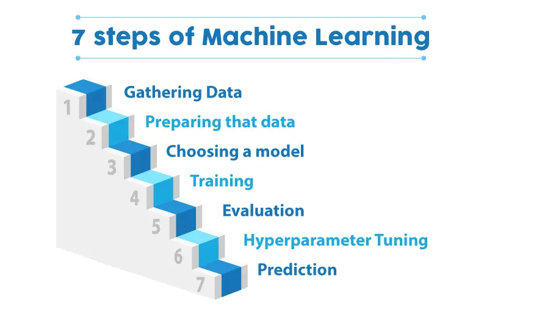
</p>

### Types of Machine Learning Algorithms:

<p align="center">
  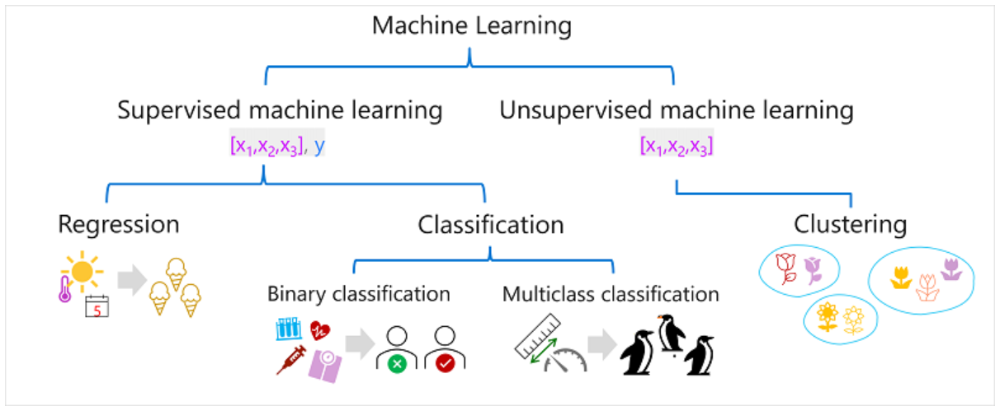
</p>

## Supervised Machine Learning:

Supervised machine learning is a general term for machine learning algorithms in which the training data includes both feature values and known label values. Supervised machine learning is used to train models by determining a relationship between the features and labels in past observations, so that unknown labels can be predicted for features in future cases.

In supervised learning, we use known or labeled data for the training data. Since the data is known, the learning is, therefore, supervised, i.e., directed into successful execution. The input data goes through the Machine Learning algorithm and is used to train the model. Once the model is trained based on the known data, you can use unknown data into the model and get a new response.

<p align="center">
  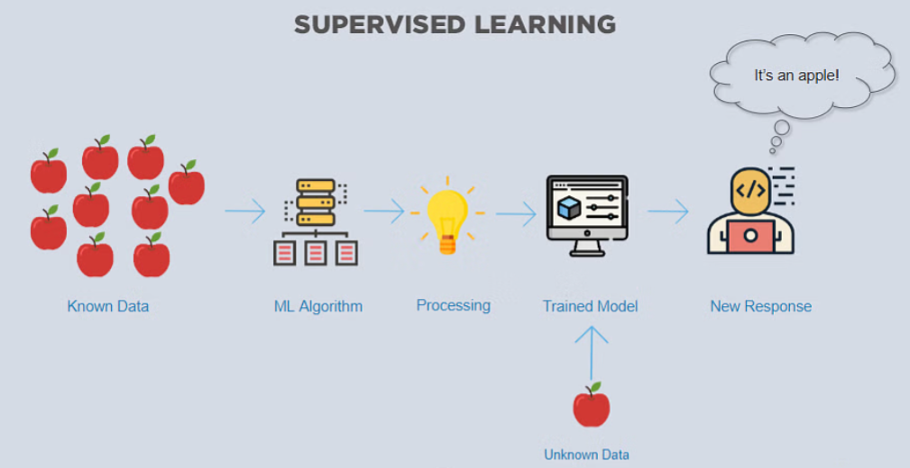
</p>

In this case, the model tries to figure out whether the data is an apple or another fruit. Once the model has been trained well, it will identify that the data is an apple and give the desired response.

Here is the list of top algorithms currently being used for supervised learning are:

* Polynomial regression
* Random forest
* Linear regression
* Logistic regression
* Decision trees
* K-nearest neighbors
* Naive Bayes

### What is Regression in Supervised ML?

Regression is a type of supervised learning where the goal is to predict a continuous value based on input data.

In other words, you're answering: **“How much?”**, **“How many?”**, or **“What value?”**

Regression in machine learning is a supervised learning technique that predicts a continuous, numerical output (dependent variable) by identifying the relationship between input features (independent variables) and a target variable. It works by training a model on historical data to learn the patterns and relationships, which then allows it to make data-backed predictions for new, unseen data, such as forecasting stock prices or predicting house values. 

In simple terms, regression analysis helps find out the cause-and-effect relationship between variables. For example, a marketer may use regression to understand how the advertising budget (independent variable) impacts sales (dependent variable).

The goal of regression modeling is to select variables that best predict the target variable and establish the form of relationships between them. This helps analyze past data to make predictions for new observations.

**Characteristics of Regression:**

| Feature           | Description                                                        |
| ----------------- | ------------------------------------------------------------------ |
| **Input**         | Known data points (features)                                       |
| **Output**        | A **real number** (continuous value)                               |
| **Goal**          | Learn a mapping from inputs to numeric outputs                     |
| **Training Data** | Includes input features **and** the correct numeric answer (label) |

**Key Concepts**

* **Dependent Variable:** The continuous, numerical outcome you are trying to predict. 
* **Independent Variables (Features):** The input factors or predictors that influence the dependent variable. 
* **Supervised Learning:** Regression is a supervised learning technique because the training data includes both the input features and the correct output values. 
* **Continuous Output:** Unlike classification, which predicts categories, regression predicts values that fall along a spectrum, such as price, quantity, or temperature. 

#### **Why Use Regression Analysis?**

There are several benefits of using regression analysis:

* **Understanding relationships:** It indicates the impact of independent variables on the dependent variable and the strength of each relationship.
* **Prediction:** Regression models derived from analyzed data can be used to predict future outcomes based on values of independent variables.
* **Forecasting:** By analyzing trends from past observations, regression allows forecasting dependent variable values over time.
* **Insight generation:** Regression output helps identify key drivers that influence the target variable and their nature of impact - positive, negative etc.
* **Decision making:** Organizations across domains like finance, marketing, and healthcare rely on regression findings for critical decisions involving resources, budgets etc.
* **Comparison of effects:** Regression permits comparing the influence of factors measured on different scales, such as price vs promotion.
* **Causal Analysis:** Under certain conditions like no multicollinearity, regression can study causative relationships between variables.

**Types of Regression Models**

Several regression models exist based on data types and relationships. The key ones are:

<p align="center">
  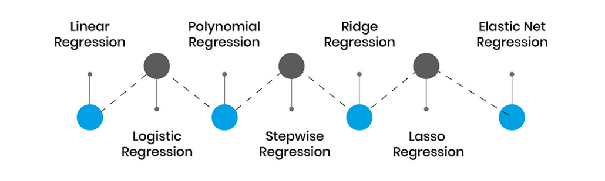
</p>

**Real-Life Examples:**

| Problem                  | Inputs (Features)               | Output (Target)    |
| ------------------------ | ------------------------------- | ------------------ |
| House price prediction   | Size, location, number of rooms | Price of the house |
| Predicting temperature   | Date, time, humidity, wind      | Temperature in °C  |
| Stock market forecasting | Company earnings, market trends | Stock price        |

**Note:** 
[Deep Dive into Regression](https://learn.microsoft.com/en-us/training/modules/fundamentals-machine-learning/4-regression?ns-enrollment-type=learningpath&ns-enrollment-id=learn.introduction-ai-azure)
### Classification:

Classification is a form of supervised machine learning in which the label represents a categorization, or class for given input data. 

   In other words, you’re answering questions like:
     **“Is this spam or not?”**, **“Is this image a cat or a dog?”**, **“Which category does this belong to?”**

<p align="center">
  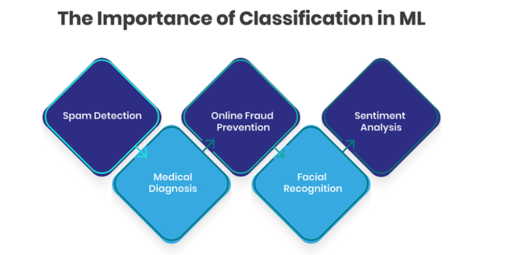
</p>

#### **How Does Classicifation works in ML?**

<p align="center">
  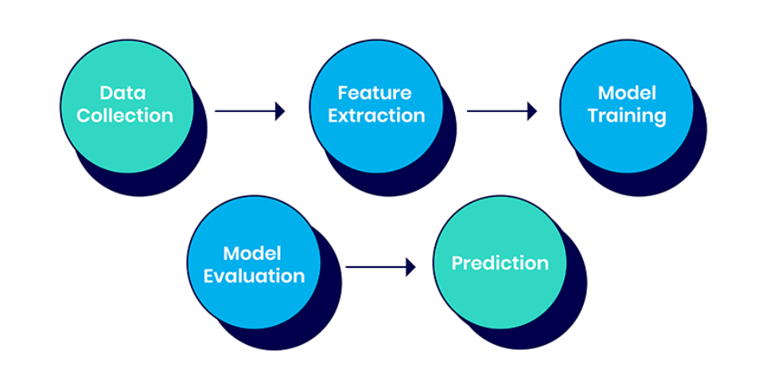
</p>

**Types of ML Classification**:

There are several types of ML classification tasks depending on the number of classes and how they are organized:

<p align="center">
  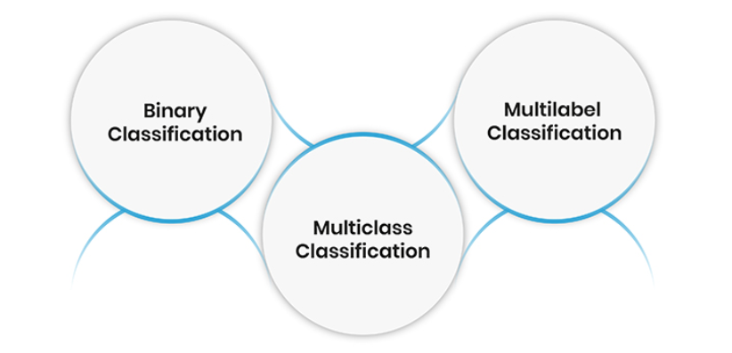
</p>

### Binary Classification:

Binary or two-class classification involves predicting one of two possible classes or categories. It is the simplest type of classification task. Binary classification problems have just two class labels to predict between.

**Common real-world examples of binary classification include:**

* **Spam filtering:** Predicting if an email is spam or not spam
* **Fraud detection:** Determining if a credit card transaction is fraudulent or valid
* **Medical testing:** Testing if a patient has a condition (positive) or not (negative)
* **Online advertising:** Classifying users as likely or unlikely to click on an ad

The two classes in binary classification problems are typically represented as 0 and 1. One class generally represents the "normal" state while the other represents the "abnormal" state. For example, emails could be classified as either "spam" (1) or "not spam" (0).

Binary classification forms the basis for other more complex classification tasks. Many multiclass classification algorithms work by combining multiple binary classification models.

### Multiclass Classification:

In multiclass classification, there are more than two possible class labels that examples can be categorized into. It is more complex than binary classification.

**Some common examples include:**

**Image recognition:** Classifying images into fine-grained categories like dog breeds or types of flowers
**Sentiment analysis:** Categorizing product/movie reviews as positive, negative or neutral
**Diagnosis:** Classifying a patient's disease into a category like heart disease, diabetes, cancer etc. based on their symptoms and medical history

The number of possible classes can range from just 3-4 labels up to hundreds or thousands of classes. For example, an image classifier that can recognize hundreds of distinct object categories.

Multiclass classification cannot be modeled as a single binary classification task. Specialized versions of algorithms are needed to handle multiple class labels effectively.

### Multilabel Classification:

In multilabel classification, examples are allowed to belong to multiple classes/categories simultaneously unlike singular assignments in multiclass classification.

**Some common examples include:**

**Document classification:** Assigning multiple topics like sports, politics, tech etc. to news articles and web pages
**Image annotation:** Tagging images with multiple relevant labels like objects present - person, car, tree etc.
**Diagnosis:** Identifying multiple conditions, a patient could have based on symptoms
**Music genre classification:** Categorizing songs into overlapping genres like pop, dance, electronic etc

Multilabel classification enables richer classifications where each example can belong to more than one category. It is a more challenging task algorithmically compared to multiclass classification. Specialized techniques are required for multilabel classification problems.

     
## Unsupervised Learning:

In unsupervised learning, the training data is unknown and unlabeled - meaning that no one has looked at the data before. Without the aspect of known data, the input cannot be guided to the algorithm, which is where the unsupervised term originates from. This data is fed to the Machine Learning algorithm and is used to train the model. The trained model tries to search for a pattern and give the desired response. In this case, it is often like the algorithm is trying to break code like the Enigma machine but without the human mind directly involved but rather a machine.

<p align="center">
  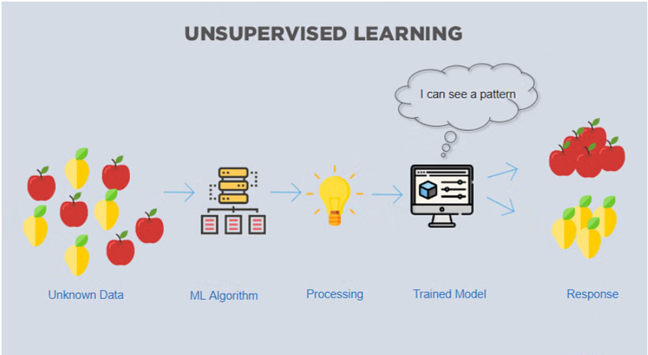
</p>

In this case, the unknown data consists of apples and pears which look similar to each other. The trained model tries to put them all together so that you get the same things in similar groups.

The top 7 algorithms currently being used for unsupervised learning are:

* Partial least squares
* Fuzzy means
* Singular value decomposition
* K-means clustering
* Apriori
* Hierarchical clustering
* Principal component analysis


