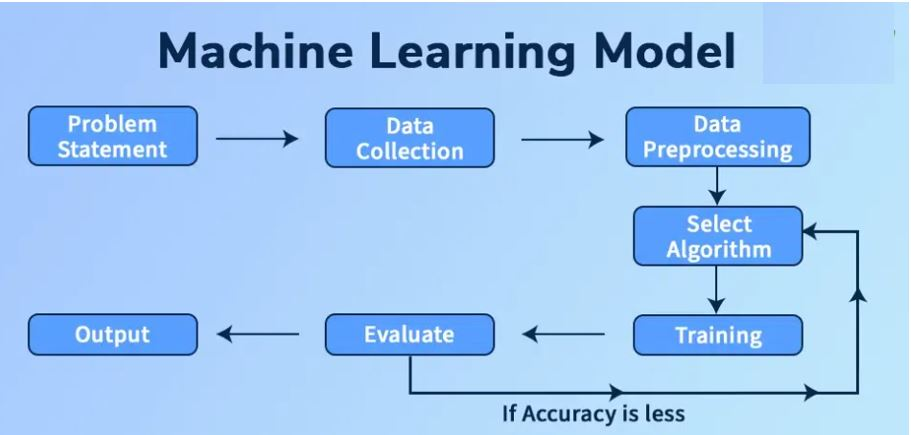

## **What is AI ?**

AI stands for Artificial Intelligence — a branch of computer science focused on creating machines or software that can perform tasks that normally require human intelligence.

In simple terms, AI is about teaching computers to “think” and “learn” like humans, though they do it in their own mathematical way.

### **Key points:**

* "Artificial" → man-made, not naturally occurring.
* "Intelligence" → the ability to understand, reason, learn, and make decisions.
* AI systems can recognize patterns, process language, solve problems, adapt from experience, and sometimes even create new content.

### Use Cases:

  

### **Types of AI:**

  

  

- **Narrow AI** (also called Weak AI) is an AI system that is designed and trained for a specific, limited task — it can be extremely good at that one thing, but it doesn’t have general problem-solving abilities like a human.

  **Examples:** siri, Cortana and Google Assistance

- **General AI** (also called Artificial General Intelligence or Strong AI) is the type of AI that can understand, learn, and apply knowledge across a wide range of tasks—just like a human.

- **Super AI** (also called Artificial Superintelligence, ASI) is a theoretical form of AI that wouldn’t just match human intelligence—it would surpass it in every way: reasoning, creativity, problem-solving, emotional understanding, and even social skills.

### **Key Concepts within AI:**

  

- **Machine Learning (ML):** A subset of AI where systems learn from data to identify patterns and make predictions.
  - **Unsupervised learning:** Ability to find patterns in data without human help.
  - **Supervised learning:** Humans label the data and gives general guidance.
    
- **Deep Learning (DL):** A subfield of machine learning that uses multi-layered neural networks to analyze and learn from vast amounts of data.
  
- **Generative AI:** A type of AI that can create new content, such as text, images, or code, in response to a prompt. This is what powers models like ChatGPT and other large language models (LLMs).
  
- **Neural Networks:** Neural networks are computational models inspired by the structure and features of the human brain. They include interconnected nodes (synthetic neurons) that take in data and bring output through mathematical operations.
  
- **Deep Learning:** Deep learning is a branch of machine learning that processes a large amount of data and to finds patterns in it by using multi-layered neural networks. It makes it possible for computers to mimic the human brain and its decision making process.
  
- **Natural Language Processing (NLP):** The digital innovations within AI responding and interacting in the human language, are unlimited. With models like the GPT4, advanced chatbots, voice assistants, and automated writing instruments are capable of report writing, summarizing text, and allowing life-like conversations, making communication seamless.
  
- **Computer Vision:** It refers to the AI's ability to interpret visual data. It has been a leading factor for the advancement of facial recognition, autonomous vehicles, and medical diagnostics. Computer vision is transforming how businesses make use of visual information - from identifying diseases in medical scans to aiding retail and security applications.
  
- **Expert Systems:** Expert systems are AI applications that mimic the decision-making potential of human professionals in different domains. They use understanding bases and inference engines to clear up complicated issues by applying regulations and heuristics derived from human know-how. Expert systems were used in medical analysis, financial planning, and danger evaluation.

## What is an ML Model ?

An ML model (Machine Learning model) is a program or mathematical representation that has been trained to recognize patterns, make predictions, or take decisions based on data — without being explicitly programmed for every rule.

  

# Generative AI:

## Key points to understand about generative AI include:

* **Generative AI** is a branch of AI that enables software applications to generate new content; often natural language dialogs, but also images, video, code, and other formats.
* The ability to generate content is based on a language model, which has been trained with huge volumes of data - often documents from the Internet or other public sources of information.
* Generative AI models encapsulate semantic relationships between language elements (that's a fancy way of saying that the models "know" how words relate to one another), and that's what enables them to generate a meaningful sequence of text.
* There are large language models (LLMs) and small language models (SLMs) - the difference is based on the volume of data and the number of variables in the model. LLMs are very powerful and generalize well, but can be more costly to train and use. SLMs tend to work well in scenarios that are more focused on specific topic areas, and usually cost less.

### **Generative AI scenarios**

Common uses of generative AI include:

* Implementing chatbots and AI agents that assist human users.
* Creating new documents or other content (often as a starting point for further iterative development)
* Automated translation of text between languages.
* Summarizing or explaining complex documents.

# Computer Vision

## **Key points to understand about computer vision include:**

* **Computer vision** is accomplished by using large numbers of images to train a model.

* **Image classification** is a form of computer vision in which a model is trained with images that are labeled with the main subject of the image (in other words, what it's an image of) so that it can analyze unlabeled images and predict the most appropriate label - identifying the subject of the image.

* **Object detection** is a form of computer vision in which the model is trained to identify the location of specific objects in an image.
There are more advanced forms of computer vision - for example, **semantic segmentation** is an advanced form of object detection where, rather than indicate an object's location by drawing a box around it, the model can identify the individual pixels in the image that belong to a particular object.

* You can combine computer vision and language models to create a multi-modal model that combines computer vision and generative AI capabilities.

### **Computer vision scenarios**

Common uses of computer vision include:

* Auto-captioning or tag-generation for photographs.
* Visual search.
* Monitoring stock levels or identifying items for checkout in retail scenarios.
* Security video monitoring.
* Authentication through facial recognition.
* Robotics and self-driving vehicles.

# Speech:

## Key points to understand about speech include:

* **Speech recognition** is the ability of AI to "hear" and interpret speech. Usually this capability takes the form of speech-to-text (where the audio signal for the speech is transcribed into text).

* **Speech synthesis** is the ability of AI to vocalize words as spoken language. Usually this capability takes the form of text-to-speech in which information in text format is converted into an audible signal.

* AI speech technology is evolving rapidly to handle challenges like ignoring background noise, detecting interruptions, and generating increasingly expressive and human-like voices.

### AI speech scenarios

Common uses of AI speech technologies include:

* Personal AI assistants in phones, computers, or household devices with which you interact by talking.
* Automated transcription of calls or meetings.
* Automating audio descriptions of video or text.
* Automated speech translation between languages.

# Natual Language Processing (NLP)

## Key points to understand about natural language processing (NLP) include:

* NLP capabilities are based on models that are trained to do particular types of text analysis.

* While many natural language processing scenarios are handled by generative AI models today, there are many common text analytics use cases where simpler NLP language models can be more cost-effective.

* Common NLP tasks include:
  * **Entity extraction** - identifying mentions of entities like people, places, organizations in a document
  * **Text classification** - assigning document to a specific category.
  * **Sentiment analysis** - determining whether a body of text is positive, negative, or neutral and inferring opinions.
  * **Language detection** - identifying the language in which text is written.

### Natural language processing scenarios

Common uses of NLP technologies include:

* Analyzing document or transcripts of calls and meetings to determine key subjects and identify specific mentions of people, places, organizations, products, or other entities.
* Analyzing social media posts, product reviews, or articles to evaluate sentiment and opinion.
* Implementing chatbots that can answer frequently asked questions or orchestrate predictable conversational dialogs that don't require the complexity of generative AI.
