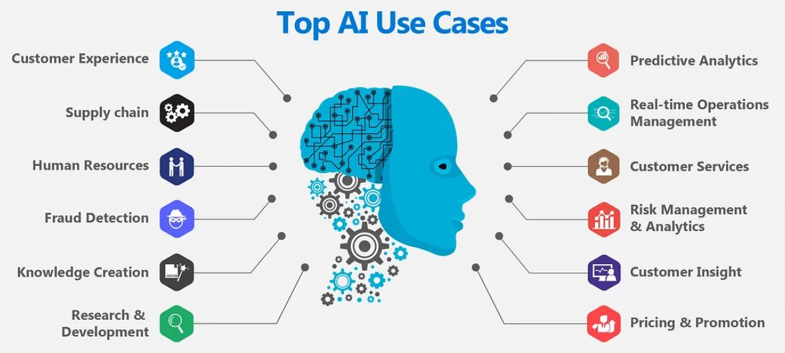
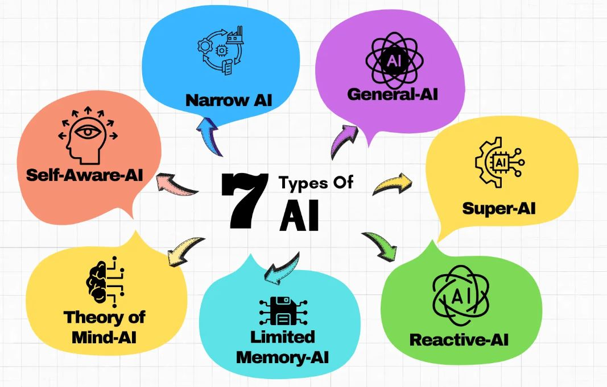
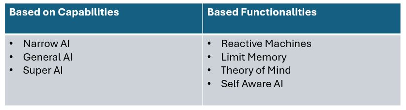
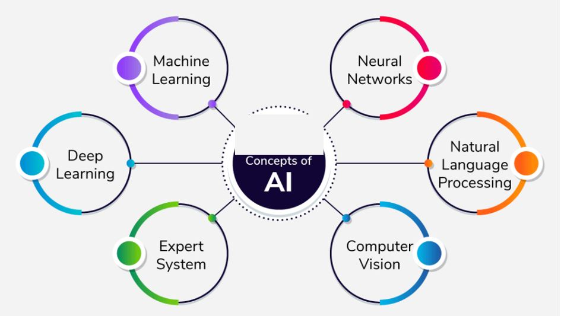

## Context:

- Describe Artificial Intelligence workloads and considerations
- Describe fundamental principles of machine learning on Azure
- Describe features of computer vision workloads on Azure
- Describe features of Natural Language Processing (NLP) workloads on Azure
- Describe features of generative AI workloads on Azure

## **What is AI ?**

AI stands for Artificial Intelligence — a branch of computer science focused on creating machines or software that can perform tasks that normally require human intelligence.

In simple terms, AI is about teaching computers to “think” and “learn” like humans, though they do it in their own mathematical way.

### **Key points:**

* "Artificial" → man-made, not naturally occurring.
* "Intelligence" → the ability to understand, reason, learn, and make decisions.
* AI systems can recognize patterns, process language, solve problems, adapt from experience, and sometimes even create new content.

### Use Cases:

  

### **Types of AI:**

  

  

- **Narrow AI** (also called Weak AI) is an AI system that is designed and trained for a specific, limited task — it can be extremely good at that one thing, but it doesn’t have general problem-solving abilities like a human.

  **Examples:** siri, Cortana and Google Assistance

- **General AI** (also called Artificial General Intelligence or Strong AI) is the type of AI that can understand, learn, and apply knowledge across a wide range of tasks—just like a human.

- **Super AI** (also called Artificial Superintelligence, ASI) is a theoretical form of AI that wouldn’t just match human intelligence—it would surpass it in every way: reasoning, creativity, problem-solving, emotional understanding, and even social skills.

### **Key Concepts within AI:**

  

- **Machine Learning (ML):** A subset of AI where systems learn from data to identify patterns and make predictions.
  - **Unsupervised learning:** Ability to find patterns in data without human help.
  - **Supervised learning:** Humans label the data and gives general guidance.
    
- **Deep Learning (DL):** A subfield of machine learning that uses multi-layered neural networks to analyze and learn from vast amounts of data.
  
- **Generative AI:** A type of AI that can create new content, such as text, images, or code, in response to a prompt. This is what powers models like ChatGPT and other large language models (LLMs).
  
- **Neural Networks:** Neural networks are computational models inspired by the structure and features of the human brain. They include interconnected nodes (synthetic neurons) that take in data and bring output through mathematical operations.
  
- **Deep Learning:** Deep learning is a branch of machine learning that processes a large amount of data and to finds patterns in it by using multi-layered neural networks. It makes it possible for computers to mimic the human brain and its decision making process.
  
- **Natural Language Processing (NLP):** The digital innovations within AI responding and interacting in the human language, are unlimited. With models like the GPT4, advanced chatbots, voice assistants, and automated writing instruments are capable of report writing, summarizing text, and allowing life-like conversations, making communication seamless.
  
- **Computer Vision:** It refers to the AI's ability to interpret visual data. It has been a leading factor for the advancement of facial recognition, autonomous vehicles, and medical diagnostics. Computer vision is transforming how businesses make use of visual information - from identifying diseases in medical scans to aiding retail and security applications.
  
- **Expert Systems:** Expert systems are AI applications that mimic the decision-making potential of human professionals in different domains. They use understanding bases and inference engines to clear up complicated issues by applying regulations and heuristics derived from human know-how. Expert systems were used in medical analysis, financial planning, and danger evaluation.
